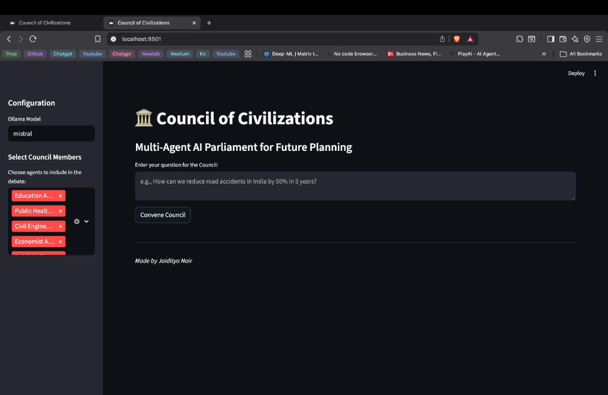
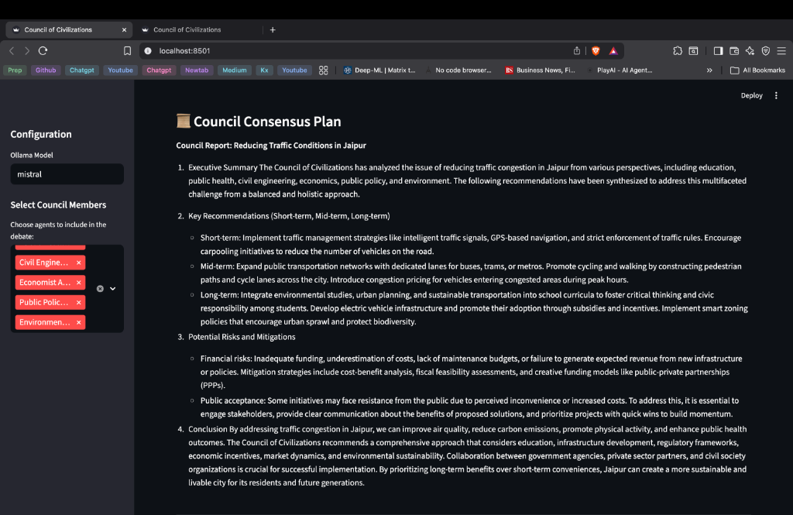

# Council of Civilizations

A multi-agent AI parliament for future planning, running locally on your Mac.

## Overview
This project simulates a council of expert agents (Policy, Doctor, Engineer, etc.) that debate and collaborate to solve complex future planning problems. It uses local LLMs via Ollama and a local vector database (ChromaDB) for domain-specific knowledge.

## Prerequisites
- Python 3.10+
- [Ollama](https://ollama.com/) installed and running
- 16GB RAM recommended

## Setup
1.  Clone the repository.
2.  Install dependencies:
    ```bash
    pip install -r requirements.txt
    ```
3.  Ensure Ollama is running (`ollama serve`) and pull a model:
    ```bash
    ollama pull mistral
    ```

## Usage
Run the Streamlit UI:
```bash
streamlit run ui/app.py
```

## Screenshots

### 1. The Council Chamber


### 2. Agents Debating


### 3. Final Consensus Plan


